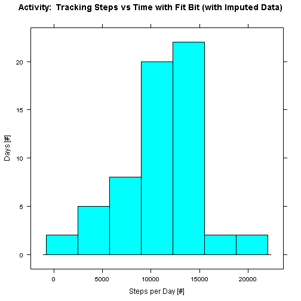
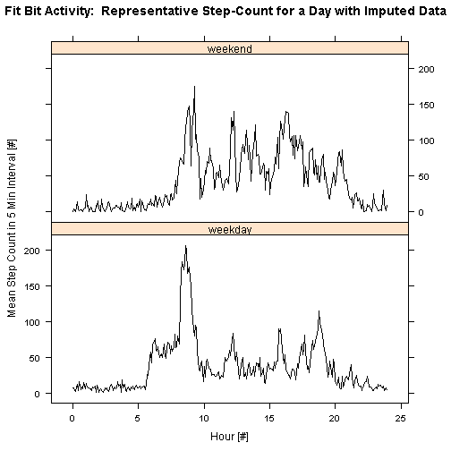

## Loading and preprocessing the data
Annonymous personal data from a Fit Bit are analyzed with R.  During a 2-month sampling period, the number of steps taken during a 5-minute interval are recorded.  Experimental data are obtained from: [Activity monitoring data](https://d396qusza40orc.cloudfront.net/repdata%2Fdata%2Factivity.zip) [52K].

Date / time values are managed using the R-package *Lubridate* for which [Dates and Times Made Easy with lubridate](http://www.jstatsoft.org/v40/i03/paper) provides good description.  Data tables are manipulated using the R-package *dplyr* for which [Package 'dplyr'](http://cran.r-project.org/web/packages/dplyr/dplyr.pdf) provides description.

The referenced libraries along with other necessary libraries are loaded into R-Studio with commands:

```r
library(dplyr)
library(lubridate)
library(lattice)
library(xtable)
```

Subsequently, data are loaded and transformed from experimental data into analytic data using chained (%>%) commands:

```r
fitBitTblDF <- tbl_df(
    read.csv2("activity.csv", sep = ",", stringsAsFactors = FALSE, na.strings = "NA",
              header = TRUE, # colClasses = c("character", "numeric", "numeric")
    )
)  %>%
    mutate(
        min = formatC(interval, big.mark=":", big.interval=2, width=4, flag = "0"),
        UTCdate = ymd( paste(date)) + hm(min),
        dayNum = yday(UTCdate),
        wDay = wday(UTCdate),
        hourDec = hour(UTCdate) + minute(UTCdate)/60 + second(UTCdate)/3600
    ) %>%
    select(
        UTCdate, min, dayNum, wDay, hourDec, interval, steps
    )%>%
    filter(
        dayNum != 275 & dayNum != 335
        & dayNum != 282 & dayNum != 306 & dayNum != 309 & dayNum != 314 & dayNum != 315 & dayNum != 319
    )
```
For this first order albeit iterated analysis, eight days for which there are no data (all entries = "NA") are excluded using the *filter* command. With *print* command, one reviews data before proceeding with statistical analyses:

```
## Source: local data frame [15,264 x 7]
## 
##                UTCdate   min dayNum wDay    hourDec interval steps
## 1  2012-10-02 00:00:00 00:00    276    3 0.00000000        0     0
## 2  2012-10-02 00:05:00 00:05    276    3 0.08333333        5     0
## 3  2012-10-02 00:10:00 00:10    276    3 0.16666667       10     0
## 4  2012-10-02 00:15:00 00:15    276    3 0.25000000       15     0
## 5  2012-10-02 00:20:00 00:20    276    3 0.33333333       20     0
## 6  2012-10-02 00:25:00 00:25    276    3 0.41666667       25     0
## 7  2012-10-02 00:30:00 00:30    276    3 0.50000000       30     0
## 8  2012-10-02 00:35:00 00:35    276    3 0.58333333       35     0
## 9  2012-10-02 00:40:00 00:40    276    3 0.66666667       40     0
## 10 2012-10-02 00:45:00 00:45    276    3 0.75000000       45     0
## ..                 ...   ...    ...  ...        ...      ...   ...
```


## What is mean total number of steps taken per day?
Analytic data are processed using chained commands from the R-package *dplyr*:

```r
fitBitSummaryDayNum <-
    fitBitTblDF %>%
    group_by(dayNum) %>%
    summarize(
        count = n(),
        meanIntervalSteps = mean(steps, na.rm = TRUE),
        cumDailySteps = sum(steps, na.rm = TRUE)
    ) %>%
    filter(cumDailySteps != 0) %>%
    arrange(dayNum)
```
A review of processed analytic data shows:

```
## Source: local data frame [53 x 4]
## 
##    dayNum count meanIntervalSteps cumDailySteps
## 1     276   288           0.43750           126
## 2     277   288          39.41667         11352
## 3     278   288          42.06944         12116
## 4     279   288          46.15972         13294
## 5     280   288          53.54167         15420
## 6     281   288          38.24653         11015
## 7     283   288          44.48264         12811
## 8     284   288          34.37500          9900
## 9     285   288          35.77778         10304
## 10    286   288          60.35417         17382
## ..    ...   ...               ...           ...
```
Aside: with the R-package *lubridate*, the UTC date is converted to show the number of day within the calendar year

For each day of the sampling period, processed data lists the mean step-count for the 5-minute intervals by day.  (During a day, there are 288 5-minute intervals, so the processed data shows self-consistency.)  Processed data also show the cumulative number of steps taken each day.  NOTE:  missing data are excluded from the mean of interval step-count and cumulative daily step-count.

From the processed data, the first figure shows a histogram of cumulative daily step-count during the 61-day sampling period from 2012 Oct 1 through 2012 Nov 30.  The *type* for this histogram is set to *count*, so the histogram is of frequency.  Therefore, the bins count the number of days with a particular step-count.  Recall, eight days are excluded from the histogram because no data are recorded.


### Six Number Summary
From the processed data, a Six Number Summary (*summary*) is generated that report min, max, quantiles, mean, and median characteristics.

The Six Number summary is displayed using the R-package *xtable*:
<!-- html table generated in R 3.1.2 by xtable 1.7-4 package -->
<!-- Sat Apr 18 16:05:41 2015 -->
<table border=1>
<tr> <th>  </th> <th> cumDailySteps </th>  </tr>
  <tr> <td align="right"> 1 </td> <td> Min.   :   41   </td> </tr>
  <tr> <td align="right"> 2 </td> <td> 1st Qu.: 8841   </td> </tr>
  <tr> <td align="right"> 3 </td> <td> Median :10765   </td> </tr>
  <tr> <td align="right"> 4 </td> <td> Mean   :10766   </td> </tr>
  <tr> <td align="right"> 5 </td> <td> 3rd Qu.:13294   </td> </tr>
  <tr> <td align="right"> 6 </td> <td> Max.   :21194   </td> </tr>
   </table>
From the Six Number Summary, the mean number of daily steps is **Mean   :10766  steps**, and the median number of daily steps is **Median :10765   steps**.  The reported mean and median are consistent with the histogram.

## What is the average daily activity pattern?
The second figure shows a representative plot of step-counts for a day during the sample period.

*Lubridate* is used to convert the UTCdate to decimal hours, which is the x-axis.  Analytic data are processed such that the plot shows mean step-count for a given interval averaged across the 53-day data set from within the 61-day sampling period.  The maximum number of step-count is 206 and occurs during the time interval 08:35.

The following code chunk is reported for completeness and generates a Six Number Summary for the data aggregated for the second figure:

```r
fitBitSummaryMin <-
    fitBitTblDF %>%
    group_by(hourDec) %>%
    summarize(
        count = n(),
        meanIntervalStepsbyInterval = mean(steps, na.rm = TRUE),
        sdIntervalStepsbyInterval =  sd(steps, na.rm = TRUE)
    ) %>%
    filter(meanIntervalStepsbyInterval != 0) %>%
    arrange(hourDec)

# Print result to console
print(fitBitSummaryMin)
```

```
## Source: local data frame [269 x 4]
## 
##       hourDec count meanIntervalStepsbyInterval sdIntervalStepsbyInterval
## 1  0.00000000    53                   1.7169811                 7.9768351
## 2  0.08333333    53                   0.3396226                 2.4724902
## 3  0.16666667    53                   0.1320755                 0.9615239
## 4  0.25000000    53                   0.1509434                 1.0988845
## 5  0.33333333    53                   0.0754717                 0.5494423
## 6  0.41666667    53                   2.0943396                 8.7557984
## 7  0.50000000    53                   0.5283019                 3.8460958
## 8  0.58333333    53                   0.8679245                 6.3185859
## 9  0.75000000    53                   1.4716981                 9.9084342
## 10 0.83333333    53                   0.3018868                 1.5390420
## ..        ...   ...                         ...                       ...
```

```r
## Six number summary by interval

summaryNumbersByMin <- summary(select(fitBitSummaryMin,meanIntervalStepsbyInterval))
medianDailyStepsByMin <- summaryNumbersByMin[3]
meanDailyStepsByMin <- summaryNumbersByMin[4]
print(medianDailyStepsByMin)
```

```
## [1] "Median : 37.45283  "
```

```r
print(meanDailyStepsByMin)
```

```
## [1] "Mean   : 40.02301  "
```

```r
summarySDnumbersByMin <- summary(select(fitBitSummaryMin,sdIntervalStepsbyInterval))
medianDailyStepsSDByMin <- summarySDnumbersByMin[3]
meanDailyStepsSDByMin <- summarySDnumbersByMin[4]
print(medianDailyStepsSDByMin)
```

```
## [1] "Median : 97.4746  "
```

```r
print(meanDailyStepsSDByMin)
```

```
## [1] "Mean   : 88.8410  "
```
While data from this code chunk is explicitly discussed, subsequent function calls require several of these variables.


## Imputing missing values
In total, there are 2,304 missing obersations during the sampling period of 61 days.  Recall, eight days for which there are no data are exluded from the analyses previously reported.  Since there are 288 intervals per day, a minimum number of missing observations is 2304.  Hence, all the missing data are from this set of excluded 8 days.  (Recall, the analysis methodology excluded missing data from within a day for which valid step-count data exists. However, in retrospect, that generality was not needed.)

There are technical references that provide guidance for imputing missing values, e.g. [Missing-data imputation](http://www.stat.columbia.edu/~gelman/arm/missing.pdf).  For this exercise, a more pedestrian approach is used to impute missing data while reducing bias.

Missing data are replaced with the mean step-count by interval, but offset with a normal distribution with mean 0 and with standard deviation identical to that of the processed data set.  For example, given that the mean 5-min interval step-count is 40 steps with standard deviation 89 steps, a particular instance of missing data could be replaced by the value **29.684179 steps**.  (By using the function *max(Random_Replacment, 0)*, the minimum replacement value is 0 whenever a random replacement would be negative.  Hence, a positive bias is retained.)  Alternatively, one could randomly select a replacement value from the set of 53 samples for each of the 288 intervals per day.  However, that exercise is left to the reader.

The following code block shows the method by which missing data are imputed.  A scale factor is introduced that controls the magnitude of imputed data:

```r
fitBitTblDFimput <- tbl_df(
    read.csv2("activity.csv", sep = ",", stringsAsFactors = FALSE, na.strings = "NA",
              header = TRUE, # colClasses = c("character", "numeric", "numeric")
    )
)  %>%
    mutate(
        min = formatC(interval, big.mark=":", big.interval=2, width=4, flag = "0"),
        UTCdate = ymd( paste(date)) + hm(min),
        dayNum = yday(UTCdate),
        wDay = wday(UTCdate),
        hourDec = hour(UTCdate) + minute(UTCdate)/60 + second(UTCdate)/3600
    ) %>%
    select(
        UTCdate, dayNum, wDay, hourDec, steps
    )
## Generate a radomized step-count data
randomized = vector("numeric", length = dim(fitBitTblDFimput)[1])
scaleFactor = 0.65 # scaling factor to reduce upward bias of imputed data
for (i in 1:dim(fitBitTblDFimput)[1]){
    randomized[i] = max(0, scaleFactor * as.numeric(strsplit(meanDailyStepsByMin, ":")[[1]][2]) + 
                            rnorm(1, mean = 0, sd=
                                      as.numeric(strsplit(meanDailyStepsSDByMin, ":")[[1]][2])))
}
fitBitTblDFimput <- tbl_df(cbind(fitBitTblDFimput, randomized)) %>%
    mutate(
        dayFactor = ifelse(wDay %in% c(2, 3, 4, 5, 6), c("weekday"), c("weekend")),
        stepsImput = ifelse(is.na(steps), randomized, steps),
        dayFactor = as.factor(dayFactor)
    ) %>%
    select(
        UTCdate, dayNum, wDay, hourDec, steps, randomized, stepsImput, dayFactor
    )%>%
    filter(
        #         dayNum != 275 & dayNum != 335
        #         & dayNum != 282 & dayNum != 306 & dayNum != 309 & dayNum != 314 & dayNum != 315 & dayNum != 319
        #steps != "NA" 
    )
#print(fitBitTblDFimput)

## What is meant total number of steps taken per day for imputed data?
fitBitSummaryDayNumImput <-
    fitBitTblDFimput %>%
    group_by(dayNum) %>%
    summarize(
        count = n(),
        meanIntervalStepsImput = mean(stepsImput, na.rm = TRUE),
        cumDailyStepsImput = sum(stepsImput, na.rm = TRUE)
    ) %>%
    arrange(dayNum)

## Six number summary by day for imputed data

summaryNumbersByDayImput <- summary(select(fitBitSummaryDayNumImput,cumDailyStepsImput))
medianDailyStepsImput <- summaryNumbersByDayImput[3]
meanDailyStepsImput <- summaryNumbersByDayImput[4]
```

The third figure shows a histogram of the dataset with missing values replaced.

Since positive bias is expected, a scale factor is introduced for moderating the positive bias.  Ultimately, the scale factor was set at 65%.  By inspection of the histogram shown in the third figure, the mean and median step-counts are about 12,000 steps.

From a follow-on Six Number Summary, the mean number of daily steps is **Mean   :11329   steps**, and the median number of daily steps is **Median :11458   steps**.  The reported mean and median are consistent with the histogram of the third figure.

The impact of imputing replacement data is an increase in the mean and median values of 6% from the original dataset.


## Are there differences in activity patterns between weekdays and weekends?
Like the second figure, the panel plot in the fourth figure shows representative plots of step-counts for a day during the sample period conditional on whether the day is a week day or a weekend day.

Data plotted are from the imputed data set.  Given that the discussion is mostly qualitative, a 6% postive bias for using imputed data is acceptable.  Note the x-axis shows decimal hours instead of interval.  Clearly, the individual is *sleeping in* for a few hours during the weekend.  However, the most active part of the day througout the week is about 8:30AM.  With respect to the rest of the day (after 8:30AM), peak step-activity during the weekend is increased by almost 50% from a week day.  (Errands and chores anyone?.)  *Bed time* remains consistent throughout the week and is about 9:30PM.

